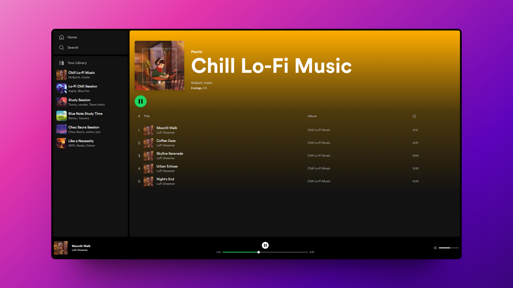

  
# 🎵 Astro - Spotify Clone

### Clon parcial del sitio web de Spotify

> 🧩 Aquí puedes ver su [**Live Demo.**](https://spotify-abraham-clone.vercel.app/)

## 🚀 Descripción

Este es un clon parcial del sitio web de **Spotify**, construido con el framework de **Astro.**

Astro es un framework de desarrollo web moderno que ofrece un rendimiento increíblemente rápido, y es agnóstico a las tecnologías que usa.

El proyecto permite reproducir, controlar el volumen y cambiar el tiempo de las músicas.

## 🎭 Tecnologías

El proyecto utiliza las siguientes tecnologías:

- [**Rutas dinámicas**](https://docs.astro.build/en/core-concepts/routing/#dynamic-routes) para crear las páginas de las playlist.
- Las [**ViewTransitions**](https://docs.astro.build/en/guides/view-transitions/) de Astro para crear animaciones entre páginas.
- [**Tailwind CSS**](https://tailwindcss.com/) para aplicar los estilos.
- **TypeScript** para almacenar los datos de las canciones y playlists.
- Componentes de **React** con Hooks.
- Componente [**Svelte**](https://svelte.dev/) para el sáludo dinámico, dependiendo del momento del día.
- Componente Slider de [**shadcn/ui**](https://ui.shadcn.com/docs/components/slider) para el volumen y la barra de reproducion.
- [**Vercel**](https://vercel.com) como adaptador para el SSR.
